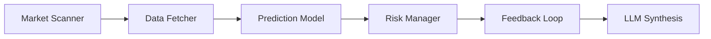

<h1 align="center">📈 CrowdWisdomTrading</h1>
<h3 align="center">⚡ Multi-Agent Crypto Prediction & Trading Intelligence System</h3>

<p align="center">
  
  
  
  
</p>

<p align="center">
  <b>🔍 Scan → 📦 Fetch → 🔮 Predict → 💰 Size → 📊 Evaluate</b>
</p>

---

## 🧠 What is CrowdWisdomTrading?

> A **multi-agent trading intelligence pipeline** that combines  
> **prediction markets + ML models + risk management + LLM reasoning**.

Unlike typical trading bots:
- ✅ Uses **market consensus (Polymarket + Kalshi)**
- ✅ Applies **ML-based predictions**
- ✅ Executes **risk-aware position sizing**
- ✅ Tracks **accuracy & arbitrage opportunities**

---

## ⚙️ System Architecture



---

## 🤖 Agent Pipeline (5-Agent System)

### 🔍 Agent 1 — Market Scanner
- Reads prediction markets (Polymarket + Kalshi)
- Extracts consensus probabilities

---

### 📦 Agent 2 — Data Fetcher
- Uses **Apify** for OHLCV data  
- Falls back to **Binance API (free)**  

---

### 🔮 Agent 3 — Predictor
- Multi-feature ML model:
  - RSI, MACD, Bollinger Bands  
  - Multi-scale returns  
- Outputs:
  - Direction (UP/DOWN)
  - Probability
  - Confidence  

---

### 💰 Agent 4 — Risk Manager
- Uses **Kelly Criterion**
- Applies:
  - Fractional Kelly  
  - Max 5% risk cap  
  - Edge filtering  

---

### 📊 Agent 5 — Feedback Loop
- Tracks accuracy  
- Updates bankroll  
- Detects arbitrage opportunities  

---

## 🤖 LLM Synthesis Layer

From your pipeline :contentReference[oaicite:1]{index=1}:

👉 Converts raw outputs into **human-readable trading insights**

```
"BTC shows bullish bias with 0.63 probability.
Recommended small position due to moderate confidence.
No strong arbitrage detected."
```

---

## 📊 Live Dashboard

Run:

```bash
streamlit run dashboard.py
```

From your dashboard :contentReference[oaicite:2]{index=2}:

- 📈 Predictions per asset  
- 💰 Bankroll tracking  
- 📊 Accuracy metrics  
- ⚡ Arbitrage detection  
- 🧾 Apify cost monitoring  

---

## 🚀 Quick Start  

```bash
pip install -r requirements.txt
cp .env.example .env
```

```bash
# Run pipeline
python run_pipeline.py

# Run continuously
python run_pipeline.py --loop

# Run dashboard
streamlit run dashboard.py
```

---

## 📂 Project Structure  

```
crowdwisdom-trading/
├── run_pipeline.py       # Orchestrator
├── dashboard.py          # Streamlit UI
├── agents/               # 5-agent system
├── tools/                # APIs + integrations
├── utils/                # config + logging
├── data/                 # predictions + logs
```

---

## 🎯 Key Features  

✔ Multi-agent architecture  
✔ ML + market consensus fusion  
✔ Kelly-based risk management  
✔ LLM-based insights  
✔ Live dashboard  

---

## 🔥 What Makes This Unique  

Most trading bots:
❌ Use only price data  

This system:
✅ Combines **market psychology + ML + risk math**

---

## 🔮 Future Improvements  

🚀 Real trade execution  
📊 Advanced ML models (XGBoost, LSTM)  
🧠 Reinforcement learning  
🌐 Cloud deployment  

---

## 💡 Philosophy  

> “Markets are not just data —  
> they are collective intelligence.”

---

<p align="center">
  📈 CrowdWisdomTrading — Turning Market Signals into Strategy
</p>
